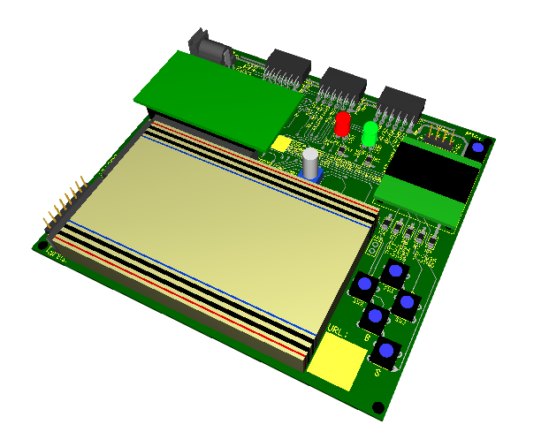

# Librairie TGP ProtoTGP

Permet le contrôle simplifié de la plateforme de développement [ProtoTPhys](http://technophys.claurendeau.qc.ca/prototphys) . Incluant les 5 boutons, 2 DELs et l'écran OLED. Elles nécessitent les autres classes [TGP Del](https://github.com/TechnoPhysCAL/TGP_Del), [TGP Bouton](https://github.com/TechnoPhysCAL/TGP_Bouton) et [TGP Ecran](https://github.com/TechnoPhysCAL/TGP_Ecran).
## Détails

[Richard Milette](https://github.com/RMtgphys) et le département de Technologie du génie physique ont développé leur propre plateforme de prototypage adaptée à l'enseignement : ProtoTPhys.




## Utilisation

```cpp
#include <ProtoTGP.h> 

ProtoTGP proto;
 
void setup()
{

  proto.begin();
}

void loop()
{
  proto.refresh(); 
  
  if (proto.haut.isPressed() || proto.bas.isPressed())  //Le bouton HAUT ou BAS est appuyé
  {
    proto.rouge.set(true); //allumer la Del rouge.

  }

  if (proto.gauche.isLongPressed() || proto.droite.isLongPressed()) //Le bouton gauche ou droite est maintenu appuyé
  {
    proto.verte.set(true); //allumer la Del verte.
  }
  
  }
  if (proto.selection.isPressed()) //Le bouton selection est appuyé
  {
    proto.ecran.ecrire("Bonjour monde!");
  }
```

## Constructeurs
```cpp
Proto()

```
On spécification nécessaire, l'initialisation des divers éléments qui constituent ProtoTPhys sont initialisés selon leur broches respectives.


## Propriétés disponibles

Dans les descriptions suivantes, la variable proto est une instance de la classe ProtoTGP.

```cpp
Bouton proto.gauche
Bouton proto.droite
Bouton proto.haut
Bouton proto.bas
Bouton proto.selection
```
Permet d'accéder aux objets de type Bouton. Toutes les méthodesde la classe Bouton sont ensuite disponibles.

---
```cpp
Del proto.rouge
Del proto.verte
```
Permet d'accéder aux objets de type Del.  Toutes les méthodes de la classe Del sont ensuite disponibles.

---
```cpp
Ecran proto.ecran
```
Permet d'accéder à l'objet de type Ecran.  Toutes les méthodes de la classe Ecran sont ensuite disponibles.

## Méthodes disponibles
```cpp
void begin()
```
Initialise toutes les composantes de la plateforme.

---
```cpp
void refresh()
```
Cette méthode doit être placée en début de boucle loop(): elle permet de mettre à jour l'état de toutes les composantes de la plateforme.

---
```cpp
void setDebounceDelay(unsigned long)
```
Permet de modifier le temps de "debouncing" en millisecondes pour tous les boutons.

---
```cpp
void setLongPressDelay(unsigned long);
```
Permet de modifier le temps en millisecondes nécessaire pour que le bouton soit considéré comme 'maintenu longtemps' pour tous les boutons.

---
```cpp
void setLongPressInterval(unsigned long);
```
Permet de modifier le temps en millisecondes entre chaque valeur vraie de la méthode  'isLongPressed()' pour tous les boutons.

---